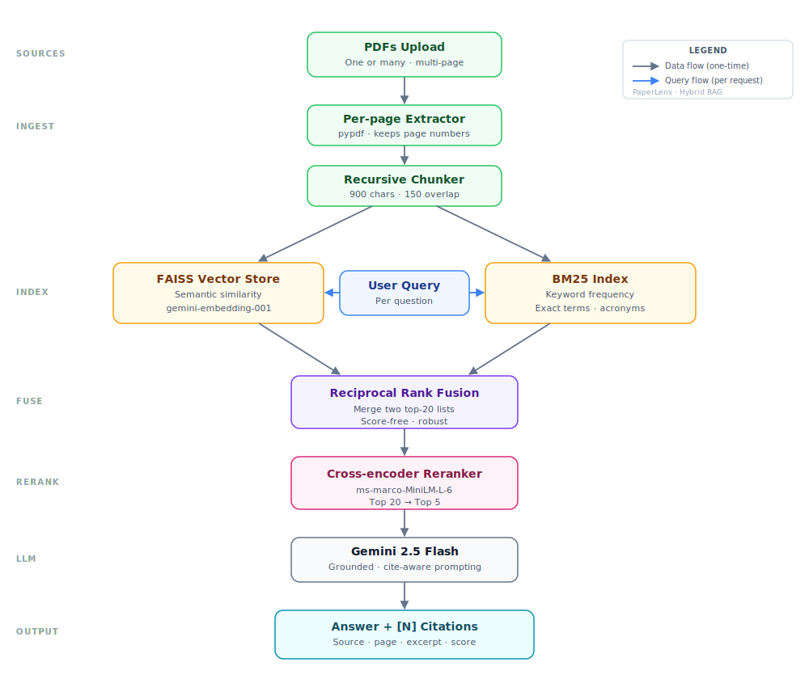

# PaperLens

[](https://github.com/VishwasPrabhakara/Chat_with_PDF/actions/workflows/tests.yml)
[](https://vishwas-paperlens-chat-with-pdf.streamlit.app)
[](https://www.python.org/)

Question answering over PDFs using hybrid retrieval, cross-encoder reranking,
and page-level citation markers.

[Live demo](https://vishwas-paperlens-chat-with-pdf.streamlit.app) |
[Security notes](SECURITY.md)



## What It Demonstrates

- PDF text extraction with page-level metadata
- Overlapping document chunking
- Gemini embeddings with FAISS semantic search
- BM25 keyword retrieval
- Reciprocal Rank Fusion across dense and sparse rankings
- Local cross-encoder reranking of retrieved candidates
- Gemini answers constrained to numbered context blocks
- Citation panels filtered to markers actually used in each answer
- Document summaries, follow-up suggestions, token accounting, and chat export
- Offline unit tests and GitHub Actions CI

PaperLens is a portfolio RAG application, not a production document-management
or factual-verification system.

## Architecture


## Retrieval Pipeline

```text
PDFs
  -> page-level text extraction
  -> overlapping chunks
  -> FAISS semantic retrieval + BM25 keyword retrieval
  -> Reciprocal Rank Fusion (top 20)
  -> cross-encoder reranking (top 5)
  -> Gemini answer with numbered context
  -> cited-source filtering and UI rendering
```

## Citation Boundary

Each context chunk receives a marker such as `[1]`. The answer prompt requires
Gemini to cite those markers inline. PaperLens now displays only valid markers
that actually appear in the generated answer, preserving their original page
and source mapping.

This improves traceability but does not prove that every generated statement
is entailed by its cited chunk. A quantitative retrieval and answer-faithfulness
benchmark has not yet been published for this project.

## Data Handling

Extracted PDF text is sent to Google Gemini for summaries, embeddings, answers,
and follow-up generation. A local Hugging Face cross-encoder reranks retrieved
chunks. The UI requires users to acknowledge this before processing documents.

Current limits:

- up to 5 PDFs per ingestion
- up to 20 MB per file
- up to 200 extracted pages
- up to 1,000,000 extracted characters

Do not upload sensitive documents to the public demo. See
[SECURITY.md](SECURITY.md).

## Run Locally

Requirements:

- Python 3.11+
- Gemini API key from [Google AI Studio](https://aistudio.google.com/apikey)

```powershell
git clone https://github.com/VishwasPrabhakara/Chat_with_PDF.git
cd Chat_with_PDF
python -m venv .venv
.\.venv\Scripts\Activate.ps1
python -m pip install -r requirements.txt
Copy-Item .env.example .env
streamlit run app.py
```

Add the Gemini key to `.env`. Current Google AI Studio authorization keys use
the `AQ.` prefix; older standard keys commonly use `AIza`.

## Tests

The automated suite avoids Gemini and model downloads. It covers chunk
metadata, RRF merging, citation-marker alignment, cited-source filtering,
follow-up parsing, text normalization, and ingestion limits.

```powershell
python -m pip install -r requirements-dev.txt
pytest
```

The optional `scripts/manual_pipeline.py` script runs the Gemini-backed
end-to-end path when a local `test.pdf` and API key are available.

## Project Layout

```text
Chat_with_PDF/
|-- .github/workflows/tests.yml
|-- scripts/manual_pipeline.py
|-- tests/test_pipeline.py
|-- app.py
|-- pipeline.py
|-- prompts.py
|-- architecture.svg
|-- SECURITY.md
|-- requirements.txt
`-- README.md
```

## Stack

Python, Streamlit, Gemini, LangChain, FAISS, BM25, sentence-transformers,
Hugging Face cross-encoders, and pypdf.

## Limitations

- No OCR for scanned or image-only PDFs
- In-memory session indexes; no durable user document store
- First cross-encoder load can be slow while model weights download
- No published retrieval or faithfulness benchmark yet

## Author

Built by [Vishwas Prabhakara](https://github.com/VishwasPrabhakara), Project
Assistant (AIML) at the Indian Institute of Science.

## License

[Apache-2.0](LICENSE)
